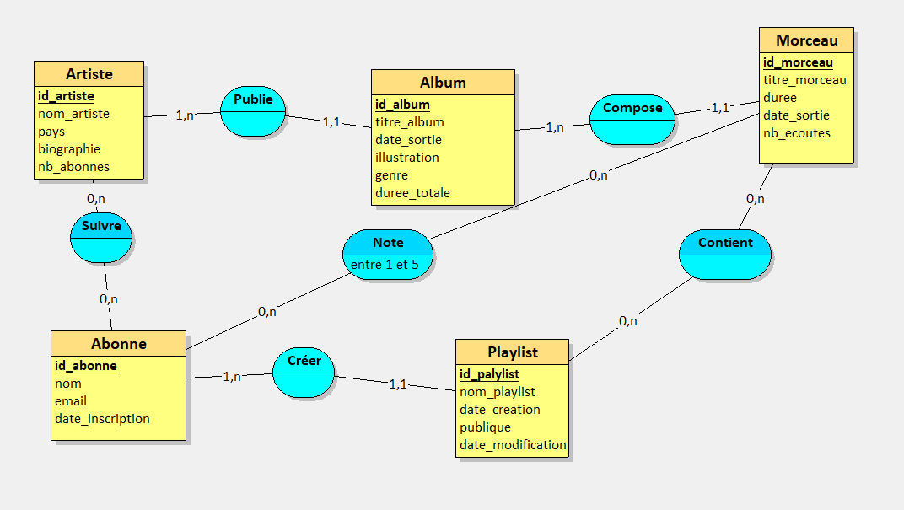
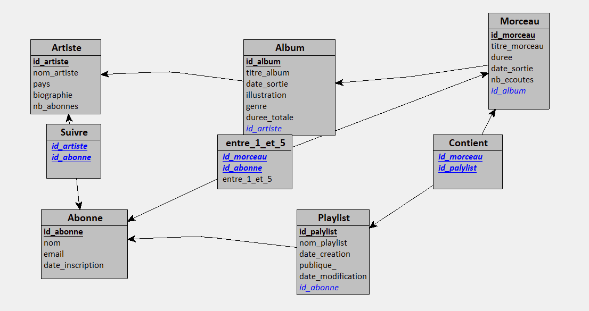

# Projet – Conception et développement d’une base de données

> **EFREI Paris** – Module **TI503N : Bases de données 1**  
> Réalisé par **Mohammed EL KARCHAL**  
> Date : *05/10/2025*  
> Encadrant : *(à compléter si connu)*

---

## Description du projet

Ce mini-projet universitaire a pour objectif de **concevoir et modéliser une base de données relationnelle** pour une **plateforme musicale en ligne**, selon la **méthode MERISE**.  
Le travail a permis d’appliquer toutes les étapes du cycle de conception d’un système d’information :

1. Définition du **dictionnaire de données** et des **règles métier**  
2. Conception du **Modèle Conceptuel de Données (MCD)**  
3. Génération du **Modèle Logique de Données (MLD)** via Looping  
4. Rédaction d’un **rapport complet** présentant la démarche

---

## Objectif fonctionnel

La plateforme musicale doit permettre :
- Aux **artistes** de publier des albums et des morceaux 🎤  
- Aux **abonnés** de créer des playlists, suivre des artistes et noter les morceaux 🎧  
- À la base de données de gérer le **catalogue musical**, les **abonnements** et les **évaluations**

---

## Règles métier principales

1. Un artiste peut publier plusieurs albums.  
2. Un album contient plusieurs morceaux.  
3. Un abonné peut créer plusieurs playlists.  
4. Une playlist contient plusieurs morceaux.  
5. Un abonné peut suivre plusieurs artistes.  
6. Un abonné peut noter plusieurs morceaux (note de 1 à 5).  

---

## Modélisation

### Modèle Conceptuel de Données (MCD)

### Modèle Logique de Données (MLD)

---

## Outils utilisés

| Outil | Utilisation |
|-------|--------------|
| **Looping** | Modélisation MCD et MLD |
| **Word** | Rédaction du rapport |
| **Git / GitHub** | Suivi de version et partage du projet |
| **(IAG)** | Génération du dictionnaire et règles métier via prompt RICARDO |

---

## Rapport complet

[Télécharger le rapport (PDF)](./Rapport_Mini_Projet_BDD_ElKarchal_Mohammed.pdf)

---

## Auteur

**Mohammed EL KARCHAL**  
Étudiant en ingénierie – EFREI Paris  
> Passionné par la conception de systèmes d’information et les bases de données.

*mohammed.el-karchal@efrei.net*  
[Profil GitHub](https://github.com/Simoelk22)

---
"Music is life — that’s why our hearts have beats"
