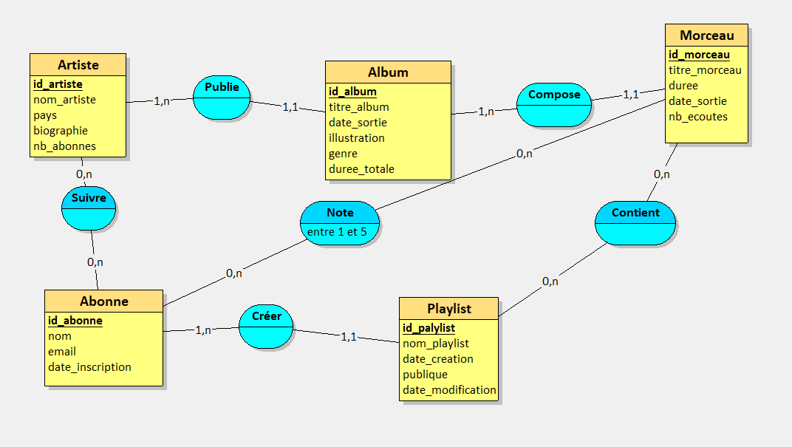
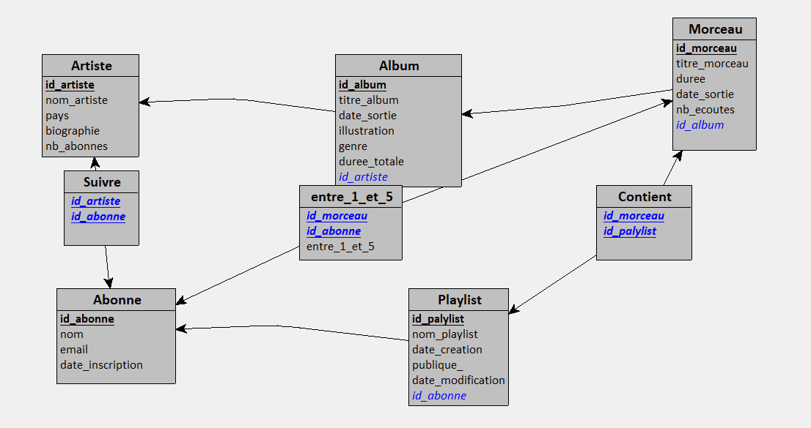

# Projet – Conception et développement d’une base de données

> **EFREI Paris** – Module **TI503N : Bases de données 1**  
> Réalisé par **Mohammed EL KARCHAL**  
> Date : *05/10/2025*  
> Encadrant : Kamel CHABCHOUB

---

## Description du projet

## 🛠️ Partie 1 

Ce mini-projet universitaire a pour objectif de **concevoir et modéliser une base de données relationnelle** pour une **plateforme musicale en ligne**, selon la **méthode MERISE**.  
Le travail a permis d’appliquer toutes les étapes du cycle de conception d’un système d’information :

1. Définition du **dictionnaire de données** et des **règles métier**  
2. Conception du **Modèle Conceptuel de Données (MCD)**  
3. Génération du **Modèle Logique de Données (MLD)** via Looping  
4. Rédaction d’un **rapport complet** présentant la démarche

---

## Objectif fonctionnel

La plateforme musicale doit permettre :
- Aux **artistes** de publier des albums et des morceaux 🎤  
- Aux **abonnés** de créer des playlists, suivre des artistes et noter les morceaux 🎧  
- À la base de données de gérer le **catalogue musical**, les **abonnements** et les **évaluations**

---

## Règles métier principales

1. Un artiste peut publier plusieurs albums.  
2. Un album contient plusieurs morceaux.  
3. Un abonné peut créer plusieurs playlists.  
4. Une playlist contient plusieurs morceaux.  
5. Un abonné peut suivre plusieurs artistes.  
6. Un abonné peut noter plusieurs morceaux (note de 1 à 5).  

---

## Modélisation

### Modèle Conceptuel de Données (MCD)

### Modèle Logique de Données (MLD)

---

## Outils utilisés

| Outil | Utilisation |
|-------|--------------|
| **Looping** | Modélisation MCD et MLD |
| **Word** | Rédaction du rapport |
| **Git / GitHub** | Suivi de version et partage du projet |
| **(IAG)** | Génération du dictionnaire et règles métier via prompt RICARDO |

---
## 🛠️ Partie 2 – Implémentation SQL et gestion des données

Après la phase de modélisation (Partie 1), cette partie consiste à implémenter concrètement la base de données dans **MySQL**.

### 🎯 Objectifs de cette partie
- Créer physiquement les tables à partir du MLD
- Appliquer les contraintes d’intégrité (PRIMARY KEY, FOREIGN KEY, UNIQUE, CHECK)
- Insérer des données réalistes (artistes, albums, morceaux, playlists, abonnés…)
- Interroger la base via des requêtes SQL avancées
- Vérifier le bon fonctionnement du modèle

---

### 📂 Scripts SQL inclus dans le projet

| Fichier SQL            | Description |
|------------------------|-------------|
| `1_creation.sql`       | Création de la base et des tables |
| `2_contraintes.sql`    | Contraintes d’intégrité et index |
| `3_insertion.sql`      | Insertion de données réelles (Damso, ElGrandeToto, Francis Mercier…) |
| `4_requetes.sql`       | Requêtes SQL et vues pour analyser la base de données |

Ces fichiers sont disponibles dans le dossier **/SQL** du dépôt GitHub.

---

### 🔧 Étapes principales exécutées

#### ✅ Création des tables
Les tables ont été créées avec les types appropriés (`INT`, `VARCHAR`, `BOOLEAN`, `DATE`) et les clés primaires/étrangères selon le modèle MERISE.

#### ✅ Ajout de contraintes
Des contraintes ont été ajoutées pour garantir la cohérence des données :
- Unicité de l’adresse email des abonnés
- Notes limitées entre 1 et 5
- Valeurs positives pour les nombres d’écoutes
- Index pour améliorer les performances

#### ✅ Insertion de données réalistes
Des données inspirées du monde réel ont été insérées pour simuler un vrai fonctionnement de plateforme musicale.

#### ✅ Requêtes d’interrogation
Des requêtes SQL ont été exécutées pour :
- Afficher les morceaux les plus écoutés
- Calculer la moyenne des notes par artiste
- Lister les playlists publiques et leur contenu
- Identifier les artistes les plus suivis

---

### 📄 Résultat final
> La base de données **plateforme_musicale** est complètement opérationnelle, fonctionnelle et conforme aux règles métier définies dans la Partie 1.  
Elle est prête pour la suite du projet (exploitation applicative).

--- 
## Rapport complet

[Télécharger le rapport partie 1 (PDF)](./Rapport_Mini_Projet_BDD_ElKarchal_Mohammed.pdf)
[Télécharger le rapport partie 1 (PDF)](./Rapport_Mini_Projet_BDD_ElKarchal_Mohammed_Partie2.pdf)

---

## Auteur

**Mohammed EL KARCHAL**  
Étudiant en ingénierie – EFREI Paris  
> Passionné par l'IA, la Musique et la Data donc je mix tous dans ce projet.

*mohammed.el-karchal@efrei.net*  
[Profil GitHub](https://github.com/Simoelk22)

---
"Music is life — that’s why our hearts have beats"
